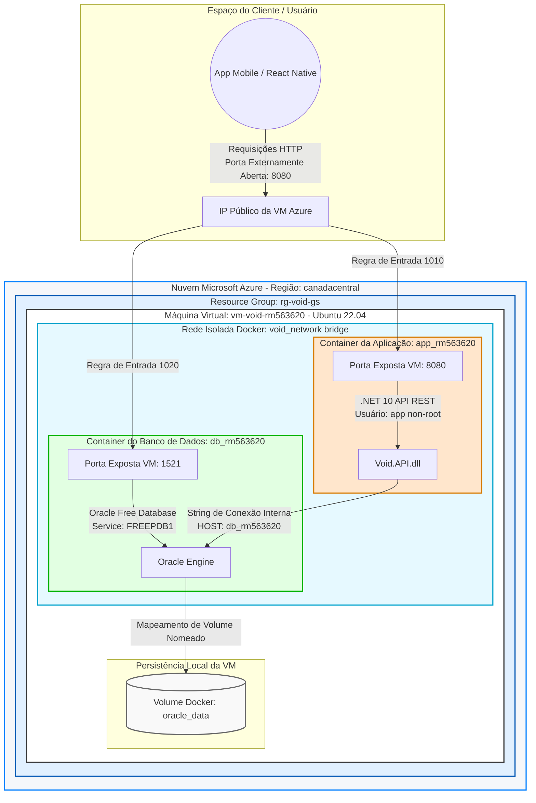

# Projeto VOID - Ecossistema de Saúde e Telemedicina Conectada

## 🌌 Alinhamento com a Economia Espacial (Global Solution)
O projeto **VOID** aborda uma oportunidade real na Terra utilizando a infraestrutura e conectividade espacial. A aplicação consiste em uma API robusta desenvolvida em .NET que viabiliza o monitoramento, triagem e gerenciamento de pacientes (`TB_VOID_PACIENTE`) em regiões remotas, isoladas ou de difícil acesso (como comunidades tradicionais, áreas de fronteira e missões de campo). 

Através da integração de dados trafegados via satélites de órbita baixa (LEO) e conectividade remota, o VOID centraliza o histórico clínico e garante a persistência segura das informações mesmo em cenários de infraestrutura terrestre severamente limitada, mitigando crises sanitárias e otimizando o fluxo de atendimento médico à distância.

---

## 🏗️ Desenho Macro da Arquitetura na Nuvem
O diagrama abaixo representa o fluxo da solução implantada na nuvem da Microsoft Azure, ilustrando o isolamento de rede dos containers Docker, mapeamento de portas externas e persistência em volumes.



## ☁️ Provisionamento da Infraestrutura (Azure CLI)

Antes da implantação da aplicação, o ambiente em nuvem foi totalmente provisionado via linha de comando utilizando o Azure CLI. Abaixo está o histórico estruturado dos comandos executados para criar o grupo de recursos, a máquina virtual e configurar as regras de firewall.

### 1. Criação do Resource Group e Máquina Virtual
```bash
# Criar o Resource Group na região selecionada (canadacentral)
az group create --name rg-void-gs --location canadacentral

# Criar a Máquina Virtual (Ubuntu 22.04) e gerar automaticamente as chaves SSH
az vm create \
  --resource-group rg-void-gs \
  --name vm-void-rm563620 \
  --image Ubuntu2204 \
  --size Standard_B2s_v2 \
  --admin-username azureuser \
  --generate-ssh-keys

  2. Configuração de Rede (Firewall)
  # Liberar a porta 8080 para permitir o tráfego HTTP externo até a API .NET
az vm open-port --resource-group rg-void-gs --name vm-void-rm563620 --port 8080 --priority 1010

# Liberar a porta 1521 para permitir conexões externas ao Banco de Dados Oracle
az vm open-port --resource-group rg-void-gs --name vm-void-rm563620 --port 1521 --priority 1020

3. Obtenção do IP e Acesso
# Consultar e retornar o IP Público atribuído à VM
az vm show -d -g rg-void-gs -n vm-void-rm563620 --query publicIps -o tsv

# Acessar a máquina virtual via SSH utilizando o IP retornado
ssh azureuser@<IP_PUBLICO_GERADO>

🚀 How-To: Guia de Implantação e Execução em Nuvem
Siga os passos abaixo para clonar, configurar e validar o ambiente completo da aplicação a partir de uma instância limpa do Ubuntu Server na nuvem.

1. Preparação do Ambiente na Máquina Virtual Azure
Após realizar o acesso SSH na sua instância (ssh azureuser@<IP_PUBLICO>), atualize os pacotes do sistema e instale os motores do Docker, Docker Compose e Git:

# Atualizar lista de repositórios
sudo apt-get update

# Instalar o Docker, Docker Compose V2 e Git de forma automatizada
sudo apt-get install docker.io docker-compose-v2 git -y

# Configurar permissões para executar o Docker sem necessidade de sudo (segurança do ambiente)
sudo usermod -aG docker $USER
newgrp docker

# Clonar o repositório do projeto
git clone <URL_DO_SEU_REPOSITORIO_GITHUB>
cd <NOME_DA_PASTA_DO_PROJETO>

# Inicializar os containers orquestrados (App e Banco) em modo background
docker compose up -d

# Analisar logs de inicialização da API .NET
docker logs app_rm563620

# Analisar logs de inicialização do Banco Oracle Free
docker logs db_rm563620

# Entrar no terminal do container da aplicação
docker container exec -it app_rm563620 sh

# Executar comandos de validação de infraestrutura interna
ls -l        # Exibir a estrutura de diretórios do sistema de arquivos compilado
pwd          # Validar o diretório de trabalho padrão mapeado (/app)
whoami       # Confirmar o usuário não-privilegiado ativo (deve retornar: app)

# Sair do container da aplicação
exit

# Acessar o SQL*Plus dentro do container do banco utilizando as credenciais de estudante
docker container exec -it db_rm563620 sqlplus rm563620/200207@FREEPDB1

# Executar a consulta de validação na tabela de dados populada
SELECT * FROM TB_VOID_PACIENTE;

# Encerrar a sessão do banco de dados
exit
